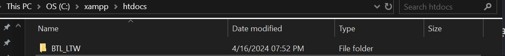
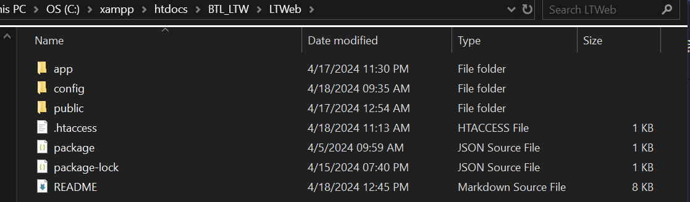
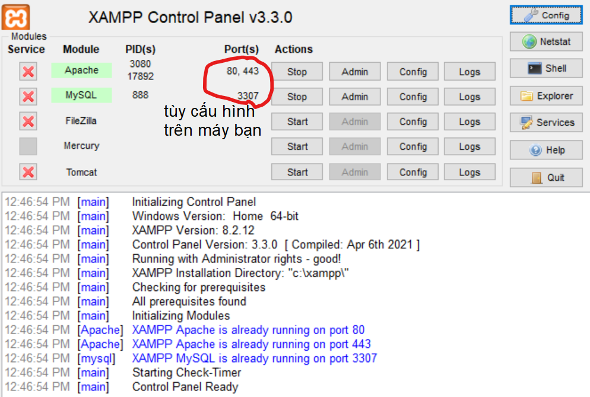

# 1. Ngôn ngữ: HTML/CSS, Sass, Javascript.

-   CSS có cài đặt sẵn Grid System của Bootstrap (chỉ Grid thôi nha)

# 2. Để chạy được project

-  Project này có sử dụng Sass, do đó bạn cần cài đặt một số cái như sau:

-   Cài đặt node js
-   Cài đặt Sass: trong Bash chạy câu lệnh **npm i sass -g**
-   Nếu cài đặt Sass mà bị lỗi không có quyền, thì mở lại Bash ở Run as admin
-   Đã có cấu hình trong package.json câu lệnh sass như sau: **"sass": "sass scss:assets/css -w"**
-   Nên khi viết code trong các file sass, để tạo ra được code tương ứng trong các file css thì dùng câu lệnh: **npm run sass**
-   Sau khi chạy xong thì mỗi lần lưu lại file Sass sẽ tự động tạo file CSS

# 3. Ứng dụng được xây dựng theo mô hình MVC
- Tham khảo: ```https://topdev.vn/blog/mo-hinh-mvc-trong-php/#b-tang-model-va-cac-lop-thuc-the-entity-class``` có code, hình minh họa

### 3.1 Cấu trúc Repository:
```
LTWeb/
├── app/
│   ├── controllers/
|   │   ├── example/...
|   │   ├── ...
|   │   ├── Favourite.php
|   │   ├── ...
|   │   ├── Home.php
|   │   ├── ...
|   │   └── SignUp.php
│   ├── middlewares/
|   │   ├── Auth.php
|   │   ├── Guest.php
|   │   └── Middleware.php
│   ├── models/
|   │   ├── example/...
|   │   ├── Database.php
|   │   └── LoginModel.php
│   ├── views/
|   │   ├── components/
|   │   |   ├── filter.php
|   │   |   ├── footer.php
|   │   |   ├── header-logined.php
|   │   |   └── header.php
|   │   ├── ...
|   │   ├── favourite.php
|   │   ├── ...
|   │   ├── index.php
|   │   ├── ...
|   │   └── sign-up.php
│   ├── router.php
│   └── routes.php
├── config/
│   └── dbConfig.php
├── public/
|   ├── assets/
|   │   ├── css/...
|   │   ├── favicon/...
|   │   ├── font/...
|   │   ├── icons/...
|   │   ├── img/...
|   │   └── js/
|   │       ├── add-new-cart.js
|   │       ├── edit-personal-info.js
|   │       ├── payment.js
|   │       ├── product-detail.js
|   │       ├── scripts.js
|   │       └── shipping.js
|   ├── csv_data/...
|   ├── scss/...
|   ├── xlsx_data/...
|   └── index.php
├── sql/
|   └── create.sql
├── .htaccess
├── package-lock.json
├── package.json
└── README.md
```
### 3.2.1 /app/controllers/ *nhận request từ client, phân tích request, gọi tầng Model để lấy dữ liệu và tầng View để tổ chức hiển thị dữ liệu* <br>
- Xem ví dụ trong thư mục ```/app/controllers/example/```

### 3.2.2 /app/middlewares/ *Middleware là bước trung gian để xử lý request trước khi ánh xạ request đó đến controller tương ứng, xem file /app/middlewares/Middleware.php *
```
//trong file router.php
if (isset($routes[$method]) && array_key_exists($url, $routes[$method])) {
    //ánh xạ đến middleware
    Middleware::drive($routes[$method][$url]['middleware']);
    
    //ánh xạ đến controller
    require_once $routes[$method][$url]['controller'];
} else {
    abort();
}
```
---
### 3.3 /app/models/ *chứa các class tương ứng với các thực thể trong ERD và các model để lưu trữ cũng như truy vấn dữ liệu.*<br>
- Database.php: *Tạo kết nối đến cơ sở dữ liệu, biến $dbConfig chứa các thông tin liên quan đến username, password, host để kết nối với cơ sở dữ liệu, đặt trong file /config/config.php*<br> 
- Xem ví dụ trong thư mục ```/app/models/example/```
---
### 3.4 /app/views/ *dùng để định dạng hiển thị dữ liệu lên cho người dùng - code front-end được đặt ở đây*
**NOTE:** Các file nằm trong thư mục templates như filter.html, header.html, footer.html, mình đã đưa vào thư mục /app/views/components/.

---
### 3.5 /app/router.php *ánh xạ các request đến middleware và controller tương ứng để xử lý request đó*
---
### 3.6 /app/routes.php *chứa thông tin ánh xạ*
---
### 3.7 /config/dbConfig.php *chứa cấu hình của Database, các cấu hình khác nếu có cũng đặt trong thư mục /config/*
---
### 3.8 /public/assets/ *chứa mã css, javascript, font, icons,... của các trang*
**NOTE:** Các bạn lưu ý là để link đến các mã css, javascript,... hay bất kỳ file hay thư mục nào thì mọi người nên dùng đường dẫn tương đối root-relative (```/BTL_LTW/LTWeb/directory_1/directory_2```, ```/BTL_LTW/LTWeb/directory_1/directory_2/file1```). Ví dụ: <br>
```
<!-- Styles -->
//ví dụ trong header của các file front-end
<link rel="stylesheet" href="/BTL_LTW/LTWeb/public/assets/css/main.css"/>
<!-- Scripts -->
<script src="/BTL_LTW/LTWeb/public/assets/js/scripts.js"></script>

//ví dụ trong file product-detail.js
starList.addEventListener('mouseleave', function () {
    starImages.forEach((image, i) => {
        if (i <= ratingInput.value - 1) {
            image.src = "/BTL_LTW/LTWeb/public/assets/icons/star.svg";
        } else {
            image.src = "/BTL_LTW/LTWeb/public/assets/icons/star-blank.svg";
        }
    });
});
```
**NOTE:** Việc sử dụng đường dẫn tương đối so với vị trí hiện tại (./ hay ../) có thể khiến bạn link không đúng đến các file scripts, css

---
### 3.9 /public/scss/ *chứa mã scss*
---
### 3.10 /public/index.php *đây là nơi mọi thứ bắt đầu*
```
<?php
    require_once '../app/models/Database.php';
    $dbConfig = require_once '../config/dbConfig.php';

    //kết nối cơ sở dữ liệu
    $connection = (new Database($dbConfig))->connection;

    //bắt đầu route
    require_once '../app/router.php';

    //đóng kết nối cơ sở dữ liệu
    mysqli_close($connection);
?>
```
---
### 3.11 /.htaccess
**NOTE:** File này được dùng để cấu hình cho server Apache. Đoạn code bên dưới dùng để bật chế độ rewrite URL theo quy tắc, tức là khi bạn nhập vào một URL, nếu nó thỏa điều kiện của quy tắc nào thì URL sẽ được rewrite là viết lại theo quy tắc đó.
```
# Bật chế độ rewrite URL
RewriteEngine On

# Nếu biến đường dẫn %{REQUEST_URI} (không bao gồm query string) là /BTL_LTW/LTWeb/ thì rewrite URL thành:
# '/BTL_LTW/LTWeb/public/index.php'
RewriteCond %{REQUEST_URI} ^/BTL_LTW/LTWeb/$
RewriteRule ^ /BTL_LTW/LTWeb/public/index.php [L]

# Nếu đường dẫn đến thư mục hay file không tồn tại thì rewrite mọi URL thành:
# '/BTL_LTW/LTWeb/public/index.php'
RewriteCond %{REQUEST_FILENAME} !-f
RewriteCond %{REQUEST_FILENAME} !-d
RewriteRule ^ /BTL_LTW/LTWeb/public/index.php [QSA,L]

# Cờ [L] cho biết: nếu quy tắc này phù hợp, đây sẽ là quy tắc cuối cùng được xem xét cho URL đó, và quá trình rewrite sẽ dừng lại
# Cờ [QSA] đảm bảo rằng bất kỳ chuỗi truy vấn nào được cung cấp trong URL yêu cầu ban đầu sẽ không bị mất đi sau khi áp dụng quy tắc viết lại
```
---
### 3.12 Phần còn lại ...
---
# 4. Hướng dẫn deploy trên **XAMPP**
### 4.1 Tải XAMPP, hướng dẫn tải thư mục ref bài Lab01
---
### 4.2 Tạo thư mục /BTL_LTW trong /htdocs

---
### 4.3 Trong thư mục /BTL_LTW, clone repo ```https://github.com/tanthinhvnex/LTWeb```


### 4.4 Run as adminstrator ứng dụng Xampp và start Apache và MySQL


### 4.5 Vào trình duyệt, nhập URL: ```http://localhost/BTL_LTW/LTWeb/```

# 5. Về việc include trong file PHP, các bạn có thể dùng hằng số ```__DIR__``` có giá trị là đường dẫn tuyệt đối đến file hiện tại. Ví dụ: ```C:\xampp\htdocs\BTL_LTW\LTWeb\directory1\directory2\file1```
```
//ví dụ trong file router.php
$routes = require_once __DIR__ . '/routes.php';//chứa thông tin routes
```
**NOTE:** ```__DIR``` trong ví dụ trên trả về ```C:\xampp\htdocs\BTL_LTW\LTWeb\app```

# 6. ```$_SESSION['user']``` lưu các thông tin ```'email','fullname','phone','role'``` của 1 phiên đăng nhập của người dùng
```
//Trong fileSignIn.php, khi đăng nhập thành công
if(isset($_POST['email'])) {
    $email = $_POST['email'];
    $password = $_POST['password'];

    $model = new LoginModel();
    $user = $model->login($email,$password);
    $_SESSION['user'] = $user;
    header("location: /BTL_LTW/LTWeb");
    exit();
} 
```
**NOTE: $_SESSION['user'] là 1 đối tượng của lớp User nên để lấy thông tin của email hay fullname thì mọi người lấy như này nha ```$_SESSION['user']->email```, ```$_SESSION['user]->fullname```**
```
//Lớp User, file /app/Model/User.php
class User {
    public $email;
    public $fullname;
    public $role;
    public $phone;
    // public $credit_card;

    public function __construct($pEmail, $pFullname, $pRole, $pPhone) {
        $this->email = $pEmail;
        $this->fullname = $pFullname;
        $this->role = $pRole;
        $this->phone = $pPhone;
        // $this->credit_card = $credit_card;
    }
}
```

**NOTE: Hiện tại chưa làm cái phân quyền cho admin và customer**
# 5 Hướng dẫn cấu hình XAMPP để gửi email từ Gmail
### 5.1 Cấu hình tệp php.ini

1. Mở thư mục cài đặt XAMPP.
2. Đi đến C:\xampp\php và mở tệp php.ini.
3. Tìm kiếm [mail function] bằng cách nhấn ctrl + f.
4. Tìm và cấu hình các giá trị sau:
```ini
SMTP=smtp.gmail.com
smtp_port=587
sendmail_from = YourGmailId@gmail.com
sendmail_path = "\"C:\xampp\sendmail\sendmail.exe\" -t"
```
### 5.2 Cấu hình tệp sendmail.ini
1. Đi đến C:\xampp\sendmail và mở tệp sendmail.ini.
2. Tìm kiếm [sendmail] bằng cách nhấn ctrl + f.
3. Tìm và cấu hình các giá trị sau:
```
smtp_server=smtp.gmail.com
smtp_port=587
error_logfile=error.log
debug_logfile=debug.log
auth_username=YourGmailId@gmail.com
auth_password=Your-Gmail-Password
force_sender=YourGmailId@gmail.com 

```